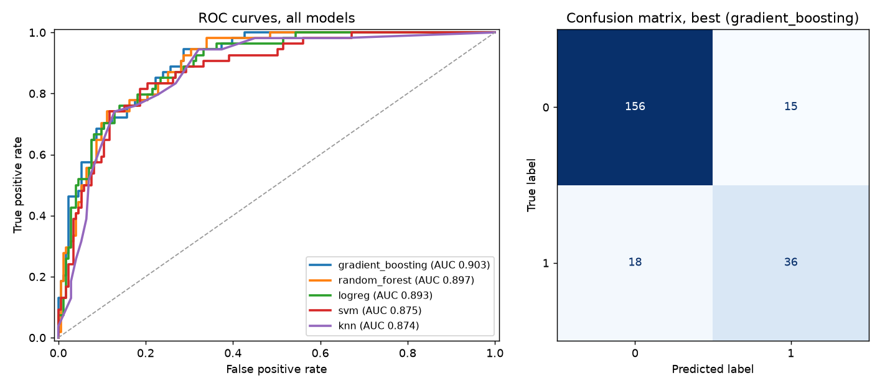

# tabml

A small library for building scikit-learn pipelines on messy tabular data. You
describe the pipeline once with a typed config, and `tabml` assembles the
preprocessing, an optional LASSO selection step, and a tuned multi-model
comparison. Import it and go:

```python
from tabml import (
    PipelineConfig, build_pipeline, compare_models,
    load_sample, train_test_split_frame, results_table,
)

data = load_sample()                       # committed offline sample, no network
train, test = train_test_split_frame(data, seed=0)

cfg = PipelineConfig(model="gradient_boosting")   # or PipelineConfig.from_yaml(...)
pipe = build_pipeline(cfg)                  # prep -> LASSO select -> classifier
pipe.fit(train.X, train.y)
pipe.predict(test.X)

results = compare_models(train, test, config=cfg)  # ranked by test ROC-AUC
print(results_table(results))
```

The preprocessor median-imputes and standardizes numeric columns, most-frequent-
imputes and one-hot encodes categoricals, and detects column types at fit time,
so the same config transfers to any mixed-type dataframe. Selection sits inside
the pipeline and is refit per cross-validation fold, so it never leaks test
information.

## Hero artifact

`compare_models` keeps each fitted estimator and its test scores, which lets
`tabml.plots.roc_panel` overlay every model's ROC curve next to the best model's
confusion matrix in one figure.



## Install

```bash
python -m venv .venv && source .venv/bin/activate   # Windows: .venv\Scripts\activate
pip install -e ".[dev]"
```

## 30-second quickstart (offline)

The repository ships a small sample, so this runs with no network and writes the
figures, `metrics.json`, and the fitted pipeline under `results/`:

```bash
python scripts/compare_models.py
```

Two runnable examples show the two entry points:

```bash
python examples/build_pipeline.py            # build and compare from a config
python examples/predict_with_saved_model.py  # load results/best_model.joblib and predict
```

For the full dataset from OpenML:

```bash
python scripts/download_data.py --out data/adult.csv --n-sample 5000
python scripts/compare_models.py --dataset adult --n-sample 5000
```

## Results (committed sample)

Measured on the committed 900-row sample (a class-stratified carve of UCI Adult,
positive rate 0.239), 75/25 stratified split, 3-fold grid search, seed 0.
Produced by `scripts/compare_models.py` in this repository. This is a controlled
validation on a small subset, not a published benchmark.

| Model | CV AUC | Test AUC | Test accuracy |
| --- | ---: | ---: | ---: |
| gradient_boosting | 0.8944 | 0.9026 | 0.8533 |
| random_forest | 0.9016 | 0.8970 | 0.8356 |
| logreg | 0.8970 | 0.8927 | 0.8356 |
| svm | 0.8821 | 0.8748 | 0.8311 |
| knn | 0.8763 | 0.8739 | 0.8311 |

Gradient boosting wins on this split, with the tree ensembles ahead of the
linear and instance-based baselines. Absolute numbers shift with the subsample
and seed; the ranking is the stable finding. See [model_card.md](model_card.md)
for the selected model's details and top features.

## Configuration

Every run is driven by a `PipelineConfig`, which loads from
[`configs/pipeline.yaml`](configs/pipeline.yaml). It controls imputers, scaler,
LASSO `alpha`, the model list, the per-model grids, and cross-validation. Edit
the YAML and rerun; nothing else changes.

## Reference

- [docs/usage.md](docs/usage.md), task-by-task walkthrough.
- [docs/api.md](docs/api.md), the full public API.
- [model_card.md](model_card.md), the committed model and its limitations.

## Scope

- Binary classification is wired end to end; multiclass and regression are not.
- Feature engineering is limited to encoding and LASSO selection, no automated
  synthesis.
- The grids are deliberately small so the demo runs on a CPU in a minute or two.
  Widen them in `configs/pipeline.yaml` for a serious search.

## Layout

```
src/tabml/       data, config, pipeline, selection, importance, compare, plots
scripts/         download_data.py, compare_models.py
examples/        build_pipeline.py, predict_with_saved_model.py
docs/            usage.md, api.md
configs/         pipeline.yaml
notebooks/       demo.ipynb
results/         committed figures, metrics.json, best_model.joblib
data/            committed sample plus data/README.md; full dataset gitignored
tests/           pytest suite for preprocessing, selection, and comparison
```

## Tests

```bash
pytest -q
ruff check src tests scripts
```

## License

MIT, see [LICENSE](LICENSE).

## Author

Aamir Malik. [GitHub](https://github.com/aamirmalik-dr) ·
[LinkedIn](https://linkedin.com/in/dr-aamirmalik)
